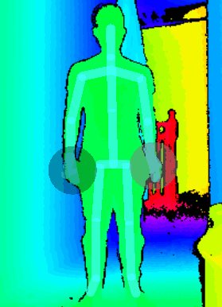

<h3 align="center">A Unity3D Project incorporating the Kinect v2, the Visual Gesture Builder Database, Multiplayer elements & voice controlled UI traversal </h3>

## Project Details

|Details  |    |
| --- | --- |
| **Project**  | [Project Spec](https://learnonline.gmit.ie/pluginfile.php/185571/mod_resource/content/0/Gesture%20Based%20UI%20Project.pdf) 
| **Course** | BSc (Hons) in Software Development
| **Module** |  Gesture Based UI Development |
| **Author** | [Faris Nassif](https://github.com/farisNassif) & [Alex Cherry](https://github.com/moecherry99) |
| **Lecturer** | Damien Costello |

### Requirements for Cloning
* [Kinect SDK](https://www.microsoft.com/en-us/download/details.aspx?id=44561)
* [Unity 2019.3.0b5](https://unity3d.com/unity/beta/2019.3.0b5) (May still work with some other versions)

### Requirements for Playing
* Have a kinect

## Summary
The project consists of two games, <b><i>BaloonGameName</i></b> & <b><i>FlapBirdGameName</i></b> which can be traversed via a voice controlled UI (<i>Can also be navigated traditionally</i>).

#### BaloonGameName
The best baloon game this side of galway

#### FlapBirdGameName
It's NOT flappy bird

  

### Refs and readme images - TODO
Beginning Microsoft Kinect for Windows SDK 2.0: Motion and Depth [pg 245]
https://prnt.sc/rhqgy4
