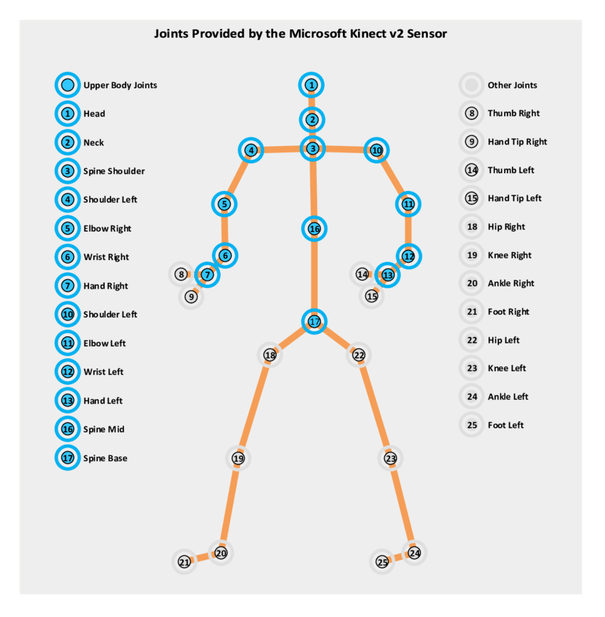
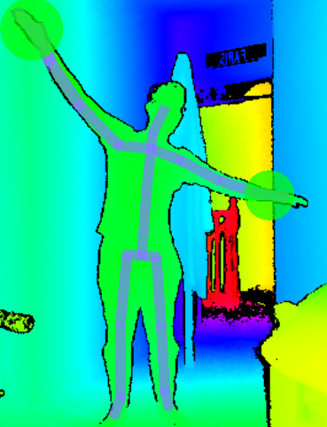
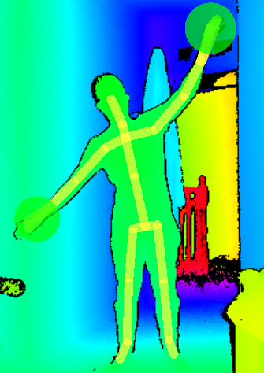

<h3 align="center">A Unity Application developed using the Kinect V2 that incorporates the unique use of various Gestures and Speech Patterns into two separate games linked together by a gesture-controlled UI</h3>

## Project Details

|Details  |    |
| --- | --- |
| **Project**  | [Project Spec](https://learnonline.gmit.ie/pluginfile.php/185571/mod_resource/content/0/Gesture%20Based%20UI%20Project.pdf) 
| **Course** | BSc (Hons) in Software Development
| **Module** |  Gesture Based UI Development |
| **Author** | [Faris Nassif](https://github.com/farisNassif) & [Alex Cherry](https://github.com/moecherry99) |
| **Lecturer** | Damien Costello |

### Requirements for Running Locally
* [Kinect SDK](https://www.microsoft.com/en-us/download/details.aspx?id=44561)
* [Unity 2019.3.0b5](https://unity3d.com/unity/beta/2019.3.0b5) (May still work with some other versions)
* Kinect v2 with a functional Microphone
<br>

<i>The Application is still functional without the above requirements (including hardware) via the Executeable</i>

### Libraries and Development Tools
* [Kinect Studio](https://developer.microsoft.com/en-us/windows/kinect/)
* [Visual Gesture Builder](https://kinect.github.io/tutorial/lab12/index.html)
* [Unity Speech Recognition API](https://docs.unity3d.com/ScriptReference/Windows.Speech.PhraseRecognitionSystem.html)
* [Kinect for Windows v2 API](https://docs.microsoft.com/en-us/previous-versions/windows/kinect/dn758675(v=ieb.10))
* [Visual Gesture Builder API](https://docs.microsoft.com/en-us/previous-versions/windows/kinect/dn763323(v=ieb.10))


## User Interface
We wanted to keep the UI as simple as possible for the user while still executing some complicated actions under the hood. The UI may be traversed normally but since the Application is centered around the Kinect v2 it wouldn't make sense for it to solely be navigated with traditional hardware like a mouse or keyboard since the user will always be standing up away from their desktop. 

To overcome this we made use of the Unity Speech Recognition API and introduced voice commands for all UI objects and also included the Swipe gesture. Beside each UI object is a key word in parentheses that may be repeated by the user to fire off the action that clicking the object would otherwise perform. Swiping with either arm would also bring them back to their previous UI scene.

## Games
For our application we decided to develop two seperate games to explore the full potential of the Kinect SDK. Both these games are quite different from eachother with the Flying Bird game being more gesturally advanced than our Balloon Popping game since it was developed after we had finished the Balloon Popping game meaning we were a lot more versed and experienced by this point when it came to incorporating different Kinect v2 features. 

### Multiplayer Balloon Popping Game
Developing this game first allowed us to get a nice feel for both the `BodySourceView` and `BodySourceManager` classes within the Kinect v2 Unity package. We simplified a lot of the code within the Kinect packages, for example instead of tracking all twenty five potential joints we only needed two for the game we wanted to develop, anything more would have overcomplicated what we wanted to achieve.

```C#
    private List<JointType> _joints = new List<JointType>
    {
        JointType.HandLeft,
        JointType.HandRight,
    };
```

We essentially slapped a game object on each joint picked up by the kinect that was picked up in the scene and added colliders. We also enabled an array of hand objects to be recognized along with removing the single entity limit in the BodySourceManager, allowing for more than one player to participate in the game at any given time.

<p align="center">
  
  <br>
  <i>All joints that may be tracked by the Kinect Sensor</i>
</p>

We got a really nice feel for how the Kinect sensor works along with how Unity interacts with joint objects, but we felt instead of incorporating gestures that potentially wouldn't fit into this game for the sake of it we concluded it would be a better idea to begin working on another game. Using the knowledge we had gained from working on this game as well as branching out and incorporating development tools like the [Visual Gesture Builder API](https://docs.microsoft.com/en-us/previous-versions/windows/kinect/dn763323(v=ieb.10)) to create unique game mechanics we felt we could make something fun that encapsulated the idea behind the project.

<p align="center">
  
  <br>
  <i>Preview of Balloon Popping with the Kinect v2 scope for reference</i>
</p>


### Flying Bird Game
Before we began development we identified what gestures would fit with the idea of controlling the flight of a bird. Initially we identified discrete hand gestures to be used as controllers however they didn't feel interactive enough. We then trained and built a Flap gesture using the Visual Gesture Builder and trialed it however it was tiresome to maintain flapping throughout the course of the game.

We settled on three seperate gestures to control the character movement

* Turn Right / Fly Up
* Turn Left / Fly Down
* Hover

<i>The above gestures may be viewed at the bottom of the document</i>

We would train and build three seperate continious gestures to keep track of movement. The easy part was implementing them into the game, the hard part was training each individual gesture build with multiple clips of each respective gesture while feeding it clips of other gestures and specifically telling it to ignore those movements to ensure a high rate of accuracy.

We also implemented a shooting mechanic but since the players hands would be occupied we thought it'd be a good idea to tie it to a vocal command. Shouting 'Fire' allowed the bird to shoot at incoming asteroids. Successfully destroying any enemy objects had a chance to restore health. Since voice commands are delayed by around 300-600ms we compensated by increasing the projectile speed of the bullet.

<p align="center">
  
   <br>
  <i>Preview of Flying with the Kinect v2 scope for reference</i>
</p>

## Gestures Identified
The below gestures incorporated into our project went through multiple builds and training sessions to ensure the highest accuracy so the flow of the game would be as fluid as possible. 

### Swipe
<p align="center">
  
  <br>
  Simple but effective swipe gesture, easy for the user to perform and since it was solely used to assist with UI traversal both left     and right-handed swipes could be registered.
</p>


### Turn Right / Fly Up
<p align="center">
  
   Continious Flying gesture that when performed by the player caused the Bird to ascend.
</p>

### Hover
<p align="center">
  
  Continious Flying gesture that when performed by the player caused the Bird to hover on the spot.
</p>

### Turn Left / Fly Down
<p align="center">
  
  Continious Flying gesture that when performed by the player caused the bird to descend.
</p>

### Refs and readme images - TODO
[1] [Beginning Microsoft Kinect for Windows SDK 2.0: Motion and Depth, Pages 241-244](Beginning%Microsoft%Kinect%for%Windows%SDK%2.0.pdf)
