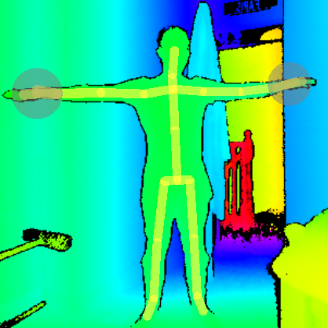

<h3 align="center">A Unity Application developed using the Kinect V2 that incorporates the unique use of various Gestures and Speech Patterns into two separate games linked together by a gesture-controlled UI</h3>

## Project Details

|Details  |    |
| --- | --- |
| **Project**  | [Project Spec](https://learnonline.gmit.ie/pluginfile.php/185571/mod_resource/content/0/Gesture%20Based%20UI%20Project.pdf) 
| **Course** | BSc (Hons) in Software Development
| **Module** |  Gesture Based UI Development |
| **Author** | [Faris Nassif](https://github.com/farisNassif) & [Alex Cherry](https://github.com/moecherry99) |
| **Lecturer** | Damien Costello |

### Requirements for Running Locally
* [Kinect SDK](https://www.microsoft.com/en-us/download/details.aspx?id=44561)
* [Unity 2019.3.0b5](https://unity3d.com/unity/beta/2019.3.0b5) (May still work with some other versions)
* Kinect v2 with a functional Microphone
 

<i>The Application is still functional without the above requirements (including hardware) via the Executeable</i>

### Libraries and Development Tools
* [Kinect Studio](https://developer.microsoft.com/en-us/windows/kinect/)
* [Visual Gesture Builder](https://kinect.github.io/tutorial/lab12/index.html)
* [Unity Speech Recognition API](https://docs.unity3d.com/ScriptReference/Windows.Speech.PhraseRecognitionSystem.html)
* [Kinect for Windows v2 API](https://docs.microsoft.com/en-us/previous-versions/windows/kinect/dn758675(v=ieb.10))
* [Visual Gesture Builder API](https://docs.microsoft.com/en-us/previous-versions/windows/kinect/dn763323(v=ieb.10))

## User Interface
We wanted to keep the UI as simple as possible for the user while still executing some complicated actions under the hood. The UI may be traversed normally but since the Application is centered around the Kinect v2 it wouldn't make sense for it to solely be navigated with traditional hardware like a mouse or keyboard since the user will always be standing up away from their desktop. 

To overcome this we introduced voice commands for all UI objects and also included the Swipe gesture. Beside each UI object is a key word in parentheses that may be repeated by the user to fire off the action that clicking the object would otherwise perform. Swiping with either arm would also bring them back to their previous UI scene.

## Games
For our application we decided to develop two seperate games to explore the full potential of the Kinect SDK. Both these games are quite different from eachother with the Flying Bird game being more gesturally advanced than our Balloon Popping game since it was developed after we had finished the Balloon Popping game meaning we were a lot more versed and experienced by this point when it came to incorporating different Kinect v2 features. 

### Balloon Popping Game

### Flying Bird Game

## Gestures Identified
Bla bla bla todo

### Swipe

  
   
  Simple but effective swipe gesture, easy for the user to perform and since it was solely used to assist with UI traversal both left     and right-handed swipes could be registered.

### Turn Right / Fly Up

  

### Hover

  

### Turn Left / Fly Down

  

### Refs and readme images - TODO
Beginning Microsoft Kinect for Windows SDK 2.0: Motion and Depth [pg 245]
